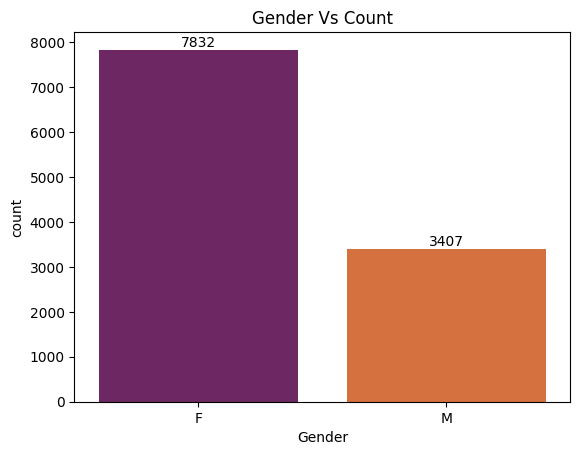
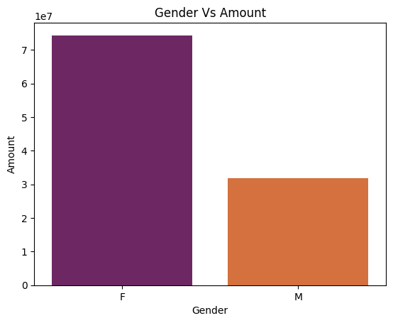
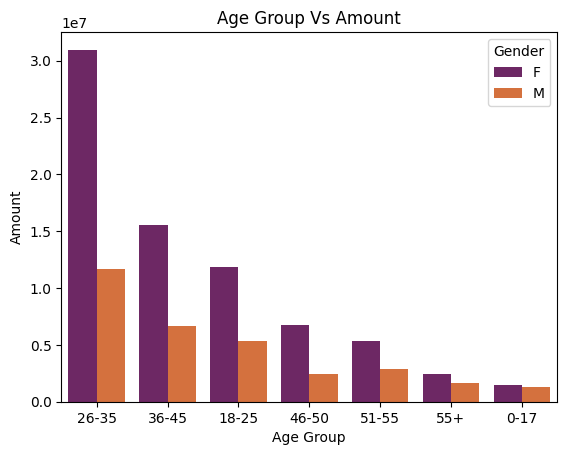
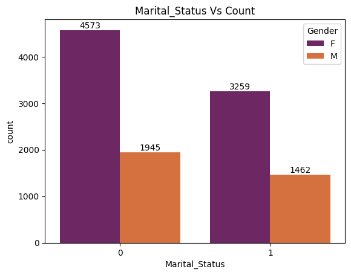
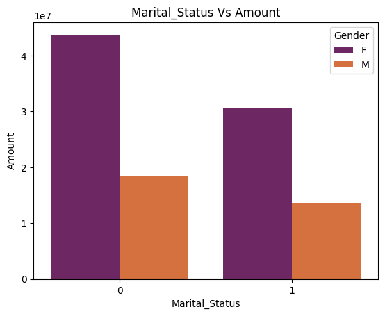

### Customer Profiling and Targeting: Analyzing Sales Data for Enhanced Market Insights in Retail

Objective: Utilize past sales data analysis to identify customer segments for a retail company, incorporating variables such as gender, age, marital status, location, product category, and product ID to optimize targeted marketing strategies.
<br>
 <br>
Data Source: Kaggle public datasets  <br>
 <br>
Tools used: Python


```python
import numpy as np
import pandas as pd
import matplotlib.pyplot as plt
import seaborn as sns
```

### Loading, cleaning & transforming the dataset:


```python
df = pd.read_csv(r'C:\Users\kriti\Downloads\Diwali Sales Data.csv', encoding='unicode_escape')
# To avoid encoding error, use 'unicode_escape'.
df.head(5)
```


<div>
<style scoped>
    .dataframe tbody tr th:only-of-type {
        vertical-align: middle;
    }

    .dataframe tbody tr th {
        vertical-align: top;
    }

    .dataframe thead th {
        text-align: right;
    }
</style>
<table border="1" class="dataframe">
  <thead>
    <tr style="text-align: right;">
      <th></th>
      <th>User_ID</th>
      <th>Cust_name</th>
      <th>Product_ID</th>
      <th>Gender</th>
      <th>Age Group</th>
      <th>Age</th>
      <th>Marital_Status</th>
      <th>State</th>
      <th>Zone</th>
      <th>Occupation</th>
      <th>Product_Category</th>
      <th>Orders</th>
      <th>Amount</th>
      <th>Status</th>
      <th>unnamed1</th>
    </tr>
  </thead>
  <tbody>
    <tr>
      <th>0</th>
      <td>1002903</td>
      <td>Sanskriti</td>
      <td>P00125942</td>
      <td>F</td>
      <td>26-35</td>
      <td>28</td>
      <td>0</td>
      <td>Maharashtra</td>
      <td>Western</td>
      <td>Healthcare</td>
      <td>Auto</td>
      <td>1</td>
      <td>23952.0</td>
      <td>NaN</td>
      <td>NaN</td>
    </tr>
    <tr>
      <th>1</th>
      <td>1000732</td>
      <td>Kartik</td>
      <td>P00110942</td>
      <td>F</td>
      <td>26-35</td>
      <td>35</td>
      <td>1</td>
      <td>Andhra Pradesh</td>
      <td>Southern</td>
      <td>Govt</td>
      <td>Auto</td>
      <td>3</td>
      <td>23934.0</td>
      <td>NaN</td>
      <td>NaN</td>
    </tr>
    <tr>
      <th>2</th>
      <td>1001990</td>
      <td>Bindu</td>
      <td>P00118542</td>
      <td>F</td>
      <td>26-35</td>
      <td>35</td>
      <td>1</td>
      <td>Uttar Pradesh</td>
      <td>Central</td>
      <td>Automobile</td>
      <td>Auto</td>
      <td>3</td>
      <td>23924.0</td>
      <td>NaN</td>
      <td>NaN</td>
    </tr>
    <tr>
      <th>3</th>
      <td>1001425</td>
      <td>Sudevi</td>
      <td>P00237842</td>
      <td>M</td>
      <td>0-17</td>
      <td>16</td>
      <td>0</td>
      <td>Karnataka</td>
      <td>Southern</td>
      <td>Construction</td>
      <td>Auto</td>
      <td>2</td>
      <td>23912.0</td>
      <td>NaN</td>
      <td>NaN</td>
    </tr>
    <tr>
      <th>4</th>
      <td>1000588</td>
      <td>Joni</td>
      <td>P00057942</td>
      <td>M</td>
      <td>26-35</td>
      <td>28</td>
      <td>1</td>
      <td>Gujarat</td>
      <td>Western</td>
      <td>Food Processing</td>
      <td>Auto</td>
      <td>2</td>
      <td>23877.0</td>
      <td>NaN</td>
      <td>NaN</td>
    </tr>
  </tbody>
</table>
</div>


```python
df.shape
```


    (11251, 15)


```python
df.info()
```

    <class 'pandas.core.frame.DataFrame'>
    RangeIndex: 11251 entries, 0 to 11250
    Data columns (total 15 columns):
     #   Column            Non-Null Count  Dtype  
    ---  ------            --------------  -----  
     0   User_ID           11251 non-null  int64  
     1   Cust_name         11251 non-null  object 
     2   Product_ID        11251 non-null  object 
     3   Gender            11251 non-null  object 
     4   Age Group         11251 non-null  object 
     5   Age               11251 non-null  int64  
     6   Marital_Status    11251 non-null  int64  
     7   State             11251 non-null  object 
     8   Zone              11251 non-null  object 
     9   Occupation        11251 non-null  object 
     10  Product_Category  11251 non-null  object 
     11  Orders            11251 non-null  int64  
     12  Amount            11239 non-null  float64
     13  Status            0 non-null      float64
     14  unnamed1          0 non-null      float64
    dtypes: float64(3), int64(4), object(8)
    memory usage: 1.3+ MB
    


```python
# Dropping unrelated/blank columns
df.drop(['Status','unnamed1'], axis=1, inplace=True)
df.info()
```

    <class 'pandas.core.frame.DataFrame'>
    RangeIndex: 11251 entries, 0 to 11250
    Data columns (total 13 columns):
     #   Column            Non-Null Count  Dtype  
    ---  ------            --------------  -----  
     0   User_ID           11251 non-null  int64  
     1   Cust_name         11251 non-null  object 
     2   Product_ID        11251 non-null  object 
     3   Gender            11251 non-null  object 
     4   Age Group         11251 non-null  object 
     5   Age               11251 non-null  int64  
     6   Marital_Status    11251 non-null  int64  
     7   State             11251 non-null  object 
     8   Zone              11251 non-null  object 
     9   Occupation        11251 non-null  object 
     10  Product_Category  11251 non-null  object 
     11  Orders            11251 non-null  int64  
     12  Amount            11239 non-null  float64
    dtypes: float64(1), int64(4), object(8)
    memory usage: 1.1+ MB
    


```python
# Checking for null values.
pd.isnull(df).sum()
```


    User_ID              0
    Cust_name            0
    Product_ID           0
    Gender               0
    Age Group            0
    Age                  0
    Marital_Status       0
    State                0
    Zone                 0
    Occupation           0
    Product_Category     0
    Orders               0
    Amount              12
    dtype: int64


```python
# Dropping the null values.
df.dropna(inplace=True)
```


```python
df.info()
```

    <class 'pandas.core.frame.DataFrame'>
    Index: 11239 entries, 0 to 11250
    Data columns (total 13 columns):
     #   Column            Non-Null Count  Dtype  
    ---  ------            --------------  -----  
     0   User_ID           11239 non-null  int64  
     1   Cust_name         11239 non-null  object 
     2   Product_ID        11239 non-null  object 
     3   Gender            11239 non-null  object 
     4   Age Group         11239 non-null  object 
     5   Age               11239 non-null  int64  
     6   Marital_Status    11239 non-null  int64  
     7   State             11239 non-null  object 
     8   Zone              11239 non-null  object 
     9   Occupation        11239 non-null  object 
     10  Product_Category  11239 non-null  object 
     11  Orders            11239 non-null  int64  
     12  Amount            11239 non-null  float64
    dtypes: float64(1), int64(4), object(8)
    memory usage: 1.2+ MB
    


```python
# Changing the datatype of Amount column from float to interger.
df['Amount']=df['Amount'].astype('int')
```


```python
# Checking the datatype of Amount column.
df['Amount'].dtypes
```


    dtype('int32')


```python
df.columns
```


    Index(['User_ID', 'Cust_name', 'Product_ID', 'Gender', 'Age Group', 'Age',
           'Marital_Status', 'State', 'Zone', 'Occupation', 'Product_Category',
           'Orders', 'Amount'],
          dtype='object')


```python
df[['Age', 'Orders', 'Amount']].describe()
```


<div>
<style scoped>
    .dataframe tbody tr th:only-of-type {
        vertical-align: middle;
    }

    .dataframe tbody tr th {
        vertical-align: top;
    }

    .dataframe thead th {
        text-align: right;
    }
</style>
<table border="1" class="dataframe">
  <thead>
    <tr style="text-align: right;">
      <th></th>
      <th>Age</th>
      <th>Orders</th>
      <th>Amount</th>
    </tr>
  </thead>
  <tbody>
    <tr>
      <th>count</th>
      <td>11239.000000</td>
      <td>11239.000000</td>
      <td>11239.000000</td>
    </tr>
    <tr>
      <th>mean</th>
      <td>35.410357</td>
      <td>2.489634</td>
      <td>9453.610553</td>
    </tr>
    <tr>
      <th>std</th>
      <td>12.753866</td>
      <td>1.114967</td>
      <td>5222.355168</td>
    </tr>
    <tr>
      <th>min</th>
      <td>12.000000</td>
      <td>1.000000</td>
      <td>188.000000</td>
    </tr>
    <tr>
      <th>25%</th>
      <td>27.000000</td>
      <td>2.000000</td>
      <td>5443.000000</td>
    </tr>
    <tr>
      <th>50%</th>
      <td>33.000000</td>
      <td>2.000000</td>
      <td>8109.000000</td>
    </tr>
    <tr>
      <th>75%</th>
      <td>43.000000</td>
      <td>3.000000</td>
      <td>12675.000000</td>
    </tr>
    <tr>
      <th>max</th>
      <td>92.000000</td>
      <td>4.000000</td>
      <td>23952.000000</td>
    </tr>
  </tbody>
</table>
</div>


### Exploratory Data Analysis and Visualizations

#### On the basis of:

#### 1. Gender-


```python
ax = sns.countplot(x='Gender', data=df, hue='Gender', palette='inferno')
for bars in ax.containers:
    ax.bar_label(bars)
plt.title('Gender Vs Count')
```


    Text(0.5, 1.0, 'Gender Vs Count')


    

    


```python
sales_gen = df.groupby(['Gender'], as_index=False)['Amount'].sum().sort_values(by='Amount',ascending=False)
sns.barplot(x='Gender', y='Amount', data=sales_gen, hue='Gender', palette='inferno')
plt.title('Gender Vs Amount')
```


    Text(0.5, 1.0, 'Gender Vs Amount')


    

    


*From above graphs we can see that most of the buyers are females and even the purchasing power of females are greater than males.*

#### Age Group-


```python
Order count
```


```python
ax = df.groupby(['Age Group'], as_index=False).value_counts().sort_values(by='count', ascending=False)
sns.countplot(data=ax, x='Age Group', hue='Gender', palette='inferno')
plt.title('Age Group Vs Count')
```


    Text(0.5, 1.0, 'Age Group Vs Count')


    

    


```python
sales_age= df.groupby(['Age Group','Gender'], as_index=False)['Amount'].sum().sort_values(by='Amount', ascending=False)
sns.barplot(data=sales_age, x='Age Group', y='Amount', hue='Gender', palette='inferno')
plt.title('Age Group Vs Amount')
```


    Text(0.5, 1.0, 'Age Group Vs Amount')


    

    


*From above graphs we can see that most of the buyers are from age group between 26-35 years female.*

#### State-


```python
df.columns
```


    Index(['User_ID', 'Cust_name', 'Product_ID', 'Gender', 'Age Group', 'Age',
           'Marital_Status', 'State', 'Zone', 'Occupation', 'Product_Category',
           'Orders', 'Amount'],
          dtype='object')


```python
sales_state= df.groupby(['State'], as_index=False)['Orders'].sum().sort_values(by='Orders', ascending=False).head(10)
plt.figure(figsize=(20,5))
sns.barplot(x='State', y='Orders', data=sales_state, hue='State', palette='inferno')
plt.title('State Vs Orders')
```


    Text(0.5, 1.0, 'State Vs Orders')


    

    


```python
sales_state= df.groupby(['State'], as_index=False)['Amount'].sum().sort_values(by='Amount', ascending=False).head(10)
plt.figure(figsize=(20,5))
sns.barplot(x='State', y='Amount', data=sales_state, hue='State', palette='inferno')
plt.title('State Vs Amount')
```


    Text(0.5, 1.0, 'State Vs Amount')


    

    


From above graphs we can see that most of the orders are from Uttar Pradesh, Maharashtra and Karnataka respectively.
But total sales/amount is from UP, Karnataka and then Maharashtra.

#### Marital Status (0=Married, 1=Unmarried)-


```python
df.columns
```


    Index(['User_ID', 'Cust_name', 'Product_ID', 'Gender', 'Age Group', 'Age',
           'Marital_Status', 'State', 'Zone', 'Occupation', 'Product_Category',
           'Orders', 'Amount'],
          dtype='object')


```python
ax= sns.countplot(data=df, x='Marital_Status', hue='Gender', palette='inferno')
for bars in ax.containers:
    ax.bar_label(bars)
plt.title('Marital_Status Vs Count')
```


    Text(0.5, 1.0, 'Marital_Status Vs Count')


    

    


```python
sales_state= df.groupby(['Marital_Status','Gender'], as_index=False)['Amount'].sum().sort_values(by='Amount', ascending=False).head(10)
sns.barplot(x='Marital_Status', y='Amount', data=sales_state, hue='Gender', palette='inferno')
plt.title('Marital_Status Vs Amount')
```


    Text(0.5, 1.0, 'Marital_Status Vs Amount')


    

    


*From above graphs we can see that most of the buyers are married women and they have a high purchasing power.*

#### Occupation


```python
df.columns
```


    Index(['User_ID', 'Cust_name', 'Product_ID', 'Gender', 'Age Group', 'Age',
           'Marital_Status', 'State', 'Zone', 'Occupation', 'Product_Category',
           'Orders', 'Amount'],
          dtype='object')


```python
plt.figure(figsize=(20,5))
sales_occ= df.groupby(['Occupation'], as_index=False)['Occupation'].value_counts().sort_values(by='count', ascending=False)
ax = sns.barplot(data=sales_occ, x='Occupation', y='count', hue='Occupation', palette='inferno')
for bars in ax.containers:
    ax.bar_label(bars)
plt.title('Occupation Vs Count')
```


    Text(0.5, 1.0, 'Occupation Vs Count')


    

    


```python
plt.figure(figsize=(20,5))
sales_occ= df.groupby(['Occupation'], as_index=False)['Amount'].sum().sort_values(by='Amount', ascending=False)
ax = sns.barplot(data=sales_occ, x='Occupation', y='Amount', hue='Occupation', palette='inferno')
for bars in ax.containers:
    ax.bar_label(bars)
plt.title('Occupation Vs Amount')
```


    Text(0.5, 1.0, 'Occupation Vs Amount')


    

    


```python
sales_occ= df.groupby(['Occupation'], as_index=False)['Gender'].value_counts().sort_values(by=['count','Occupation'], ascending=False)
plt.figure(figsize=(20,5))
ax= sns.barplot(data=sales_occ, x='Occupation', y='count', hue='Gender', palette='inferno')
for bars in ax.containers:
    ax.bar_label(bars)
plt.title('Occupation Vs Count (with Gender Distribution)')
```


    Text(0.5, 1.0, 'Occupation Vs Count (with Gender Distribution)')


    

    


```python
sales_occ= df.groupby(['Occupation','Gender'], as_index=False)['Amount'].sum().sort_values(by=['Amount'], ascending=False)
plt.figure(figsize=(20,5))
ax= sns.barplot(data=sales_occ, x='Occupation', y='Amount', hue='Gender', palette='inferno')
for bars in ax.containers:
    ax.bar_label(bars)
plt.title('Occupation Vs Amount (with Gender Distribution)')
```


    Text(0.5, 1.0, 'Occupation Vs Amount (with Gender Distribution)')


    

    


*From above graphs we can see that most of the buyers are working in IT, Aviation and Healthcare sector.*

#### Product Category-


```python
df.columns
```


    Index(['User_ID', 'Cust_name', 'Product_ID', 'Gender', 'Age Group', 'Age',
           'Marital_Status', 'State', 'Zone', 'Occupation', 'Product_Category',
           'Orders', 'Amount'],
          dtype='object')


```python
plt.figure(figsize=(20,5))
sales_pc= df.groupby(['Product_Category'], as_index=False)['Product_Category'].value_counts().sort_values(by='count', ascending=False).head(10)
ax = sns.barplot(data=sales_pc, x='Product_Category', y='count', hue='Product_Category', palette='inferno')
for bars in ax.containers:
    ax.bar_label(bars)
plt.title('Product_Category Vs Count')
```


    Text(0.5, 1.0, 'Product_Category Vs Count')


    

    


```python
plt.figure(figsize=(20,5))
sales_pc= df.groupby(['Product_Category'], as_index=False)['Amount'].sum().sort_values(by='Amount', ascending=False).head(10)
ax = sns.barplot(data=sales_pc, x='Product_Category', y='Amount', hue='Product_Category', palette='inferno')
for bars in ax.containers:
    ax.bar_label(bars)
plt.title('Product_Category Vs Amount')
```


    Text(0.5, 1.0, 'Product_Category Vs Amount')


    

    


From above graphs we can see that most of the sold products are from Food, Clothing & Apparel, and Electronics & Gadgets Category.


```python
plt.figure(figsize=(20,5))
sales_pc= df.groupby(['Product_ID'], as_index=False)['Orders'].sum().sort_values(by='Orders', ascending=False).head(10)
ax = sns.barplot(data=sales_pc, x='Product_ID', y='Orders', hue='Product_ID', palette='inferno')
for bars in ax.containers:
    ax.bar_label(bars)
plt.title('Product_ID Vs Orders')
```


    Text(0.5, 1.0, 'Product_ID Vs Orders')


    

    


### Conclusion:

1. Married women age group 26-35 yrs from Uttar Pradesh, Maharashtra and Karnataka working in IT, Aviation and Healthcare are more likely to buy products from Food, Clothing and Electronics Category.

2. Women have more purchasing power than men.

**Thank you!**


```python

```
